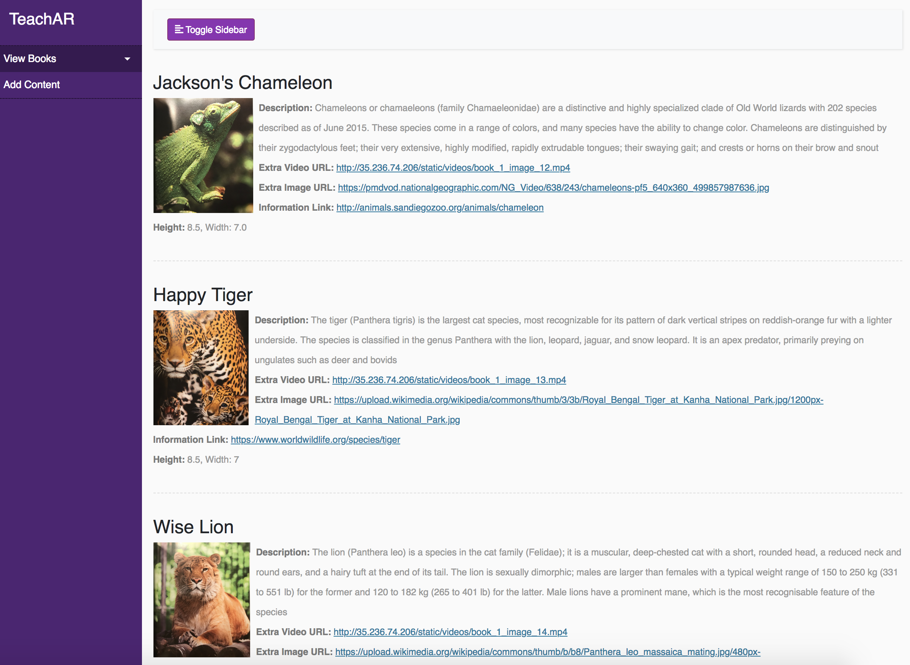
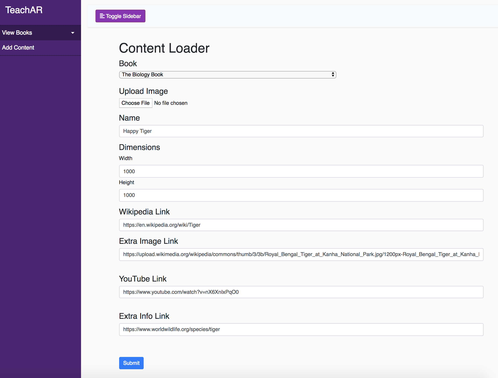

# TeachAR

## Empower Students

We built TeachAR to empower students using AR. Studies have constantly shown that the better access to textbooks and technology students have, the better their educational performance. However, the reality of the matter is that access to updated textbooks is not as widespread as is necessary to allow for better student performance and understanding of educational materials.

## What It Is

We created a platform to modernized textbooks with augmented reality (AR), crowdsourced content, and real-time communication backed by Agora. We are bridging the gap between education and technology by providing students with an AR-based application. Regardless of financial inequality among schools, students will be empowered to explore their studies in an interactive and social way.

## What It Does

Our application allows for students to take charge of their education in a fun and engaging as well as technologically advanced way.

## Augmented Reality

Students can use our platform to supplement their learning through interactive and engaging ways. Our application allows for photo and video annotations to provide an AR experience while learning. Students can use our apps to watch videos, find relevant links, and learn more information around given images throughout the textbook.

## Crowdsourced Content

All of our information is crowdsourced in a very scalable way. We have a website to provide content indexed by books and images within the book. By providing an interface to annotate these images, we believe our scalable platform for AR annotations is the first of it's kind.

## RTC

We provide real-time communication when students have questions related to the topics they see in the textbook.

## How we built it

We built this project with care. :) We are in the process of documenting our work, but the technologies we use include iOS, Swift, ARKit, Agora, Firebase, Flask, Google Cloud Platform, Full-Stack.

## What's next for TeachAR

We hope to revolutionize education by providing to all students regardless of technological and financial inequalities.
